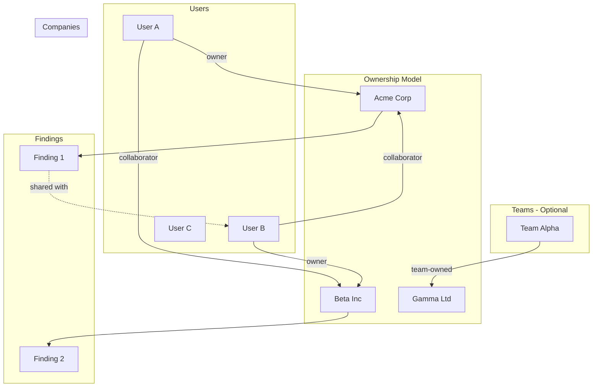
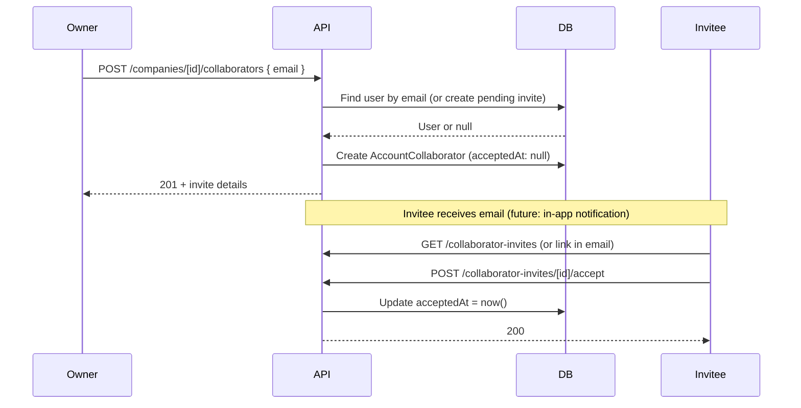
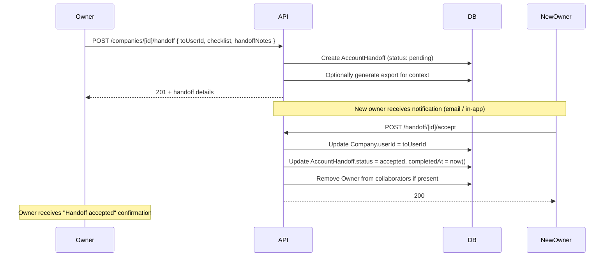
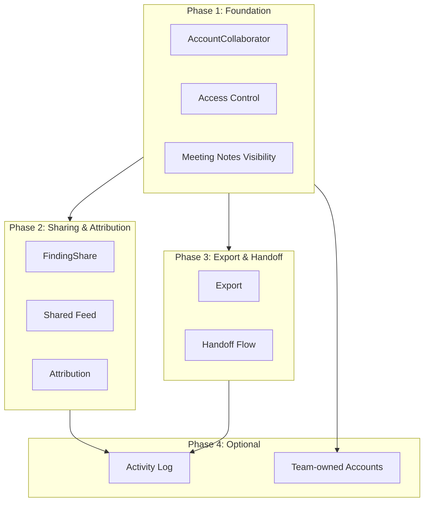

# Team Collaboration Architecture

Architecture for in-app team collaboration on accounts and shared findings. Covers B1–B5 from the collaboration brainstorm.

---

## 1. Overview



**Core concepts:**
- **Account collaborators (B3):** Users can invite peers to an account. Collaborators get read (or read/write) access to company, prospects, intel, findings.
- **Share findings (B2):** Findings can be shared with specific users. Shared findings appear in their feed and on the account if they have access.
- **Shared accounts (B1):** Optional team model. Teams own accounts; all members see them.
- **Shared findings feed (B4):** A view of findings shared with you or from accounts you collaborate on.
- **Export (B5):** Export account summary (findings + intel + synthesis) for handoffs.
- **Activity attribution:** Findings, intel, and meeting notes show who created/added them—enables recognition, coaching, and accountability.
- **Handoff flow:** Structured transfer (checklist + ownership change) for territory changes and rep transitions.
- **Meeting notes visibility:** Meeting logs are visible to all collaborators on the account.

---

## 2. Data Model

### 2.1 New Models

```prisma
// Account-level collaboration. User B is invited to User A's account.
model AccountCollaborator {
  id         String   @id @default(cuid())
  companyId  String
  userId     String
  role       String   @default("viewer")  // viewer, contributor
  invitedBy  String
  invitedAt  DateTime @default(now())
  acceptedAt DateTime?  // null until collaborator accepts

  company Company @relation(fields: [companyId], references: [id], onDelete: Cascade)
  user    User    @relation(fields: [userId], references: [id], onDelete: Cascade)
  inviter User    @relation("Inviter", fields: [invitedBy], references: [id], onDelete: Cascade)

  @@unique([companyId, userId])
  @@index([companyId])
  @@index([userId])
}

// Finding share: User A shares a finding with User B.
model FindingShare {
  id          String    @id @default(cuid())
  findingId   String
  sharedWithId String
  sharedById   String
  sharedAt   DateTime  @default(now())
  message    String?   // optional note when sharing
  shareType  String    @default("fyi")  // actionable, fyi, handoff — signals intent to recipient

  finding    SavedFinding @relation(fields: [findingId], references: [id], onDelete: Cascade)
  sharedWith User          @relation("FindingSharesReceived", fields: [sharedWithId], references: [id], onDelete: Cascade)
  sharedBy   User          @relation("FindingSharesSent", fields: [sharedById], references: [id], onDelete: Cascade)

  @@unique([findingId, sharedWithId])
  @@index([findingId])
  @@index([sharedWithId])
}

// Handoff: structured account transfer for territory changes and rep transitions.
model AccountHandoff {
  id            String    @id @default(cuid())
  companyId     String
  fromUserId    String    // current owner
  toUserId      String    // new owner
  status        String    @default("pending")  // pending, accepted, declined
  checklist     String?   // JSON: { keyContacts: bool, lastTouch: bool, openQuestions: bool, nextSteps: bool }
  handoffNotes  String?   // context from outgoing rep
  requestedAt   DateTime  @default(now())
  completedAt  DateTime?

  company Company @relation(fields: [companyId], references: [id], onDelete: Cascade)
  fromUser User   @relation("HandoffsFrom", fields: [fromUserId], references: [id], onDelete: Cascade)
  toUser   User   @relation("HandoffsTo", fields: [toUserId], references: [id], onDelete: Cascade)

  @@index([companyId])
  @@index([fromUserId])
  @@index([toUserId])
  @@index([status])
}

// Account activity log: lightweight audit of key events for coaching and attribution.
model AccountActivityLog {
  id        String   @id @default(cuid())
  companyId String
  userId    String
  action    String   // collaborator_added, finding_shared, handoff_requested, handoff_accepted, intel_added, meeting_logged
  entityType String? // finding, intel, meeting_log, etc.
  entityId  String?
  createdAt DateTime @default(now())

  company Company @relation(fields: [companyId], references: [id], onDelete: Cascade)
  user    User    @relation(fields: [userId], references: [id], onDelete: Cascade)

  @@index([companyId])
  @@index([userId])
  @@index([createdAt])
}

// Optional: Team for team-owned accounts (B1). Defer if starting with B2/B3.
model Team {
  id        String   @id @default(cuid())
  name      String
  createdAt DateTime @default(now())

  members   TeamMember[]
  companies Company[]  // companies owned by team
}

model TeamMember {
  id     String   @id @default(cuid())
  teamId String
  userId String
  role   String   @default("member")  // admin, member

  team Team @relation(fields: [teamId], references: [id], onDelete: Cascade)
  user User @relation(fields: [userId], references: [id], onDelete: Cascade)

  @@unique([teamId, userId])
  @@index([teamId])
  @@index([userId])
}
```

### 2.2 Schema Changes to Existing Models

```prisma
// Company: support team ownership (optional, for B1)
model Company {
  // ... existing fields
  userId   String?   // null when team-owned
  teamId   String?   // set when team-owned
  user     User?     @relation(...)
  team     Team?     @relation(fields: [teamId], references: [id])
  collaborators   AccountCollaborator[]
  handoffs        AccountHandoff[]
  activityLogs    AccountActivityLog[]
}

// SavedFinding: add creator and shares
model SavedFinding {
  // ... existing fields
  createdById String?   // who created it (for attribution)
  createdBy   User?     @relation("FindingsCreated", fields: [createdById], references: [id])
  shares      FindingShare[]
}

// CompanyIntel: add attribution for who surfaced/added the intel
model CompanyIntel {
  // ... existing fields
  createdById String?   // who added it (user or system); null for auto-generated
  createdBy   User?     @relation("IntelCreated", fields: [createdById], references: [id], onDelete: SetNull)
}

// MeetingLog: already has userId (who captured the note). Collaborators see via company access.
// No schema change; ensure meeting logs are loaded for collaborator accounts.

// User: add new relations
model User {
  // ... existing
  accountCollaborations AccountCollaborator[]
  findingSharesReceived FindingShare[] @relation("FindingSharesReceived")
  findingSharesSent     FindingShare[] @relation("FindingSharesSent")
  findingsCreated       SavedFinding[] @relation("FindingsCreated")
  intelCreated          CompanyIntel[] @relation("IntelCreated")
  handoffsFrom          AccountHandoff[] @relation("HandoffsFrom")
  handoffsTo            AccountHandoff[] @relation("HandoffsTo")
  accountActivityLogs   AccountActivityLog[]
  teamMemberships       TeamMember[]
}
```

**Phase 1 (MVP):** Implement `AccountCollaborator` and `FindingShare` only. Omit `Team`/`TeamMember` and `Company.teamId` until B1. Add `AccountHandoff` and `AccountActivityLog` in Phase 3 with handoff flow.

---

## 3. Activity Attribution & Meeting Notes Visibility

### 3.1 Attribution Display

- **Findings:** Show "Added by [Name]" using `SavedFinding.createdById`. Set on create from current user.
- **Intel:** Show "Added by [Name]" when `CompanyIntel.createdById` is set. For auto-generated intel (e.g. from documents), leave null.
- **Meeting logs:** `MeetingLog.userId` already indicates who captured the note. Display "Logged by [Name]" in the account view.

### 3.2 Meeting Notes Visibility for Collaborators

- Meeting logs are tied to prospects; prospects belong to companies. Collaborators with account access see all meeting logs for that company's prospects.
- Ensure `GET /api/companies/[id]/account` (or prospect/meeting routes) include meeting logs when user has collaborator access.
- Meeting logs are included in the export for handoffs.

### 3.3 Activity Log (Optional)

- `AccountActivityLog` records key events: collaborator added, finding shared, handoff requested/accepted, intel added, meeting logged.
- Use for coaching dashboards and "Recent activity" on the account page.
- Can be derived from existing data initially; add model when coaching/audit needs arise.

---

## 4. Access Control

### 4.1 Access Helper

Centralize "can user access company?" logic:

```typescript
// src/lib/access.ts

export type CompanyAccess = "owner" | "collaborator" | null;

export async function getCompanyAccess(
  companyId: string,
  userId: string
): Promise<CompanyAccess> {
  const company = await prisma.company.findUnique({
    where: { id: companyId },
    select: { userId: true },
    include: {
      collaborators: {
        where: { userId, acceptedAt: { not: null } },
        select: { id: true },
      },
    },
  });
  if (!company) return null;
  if (company.userId === userId) return "owner";
  if (company.collaborators.length > 0) return "collaborator";
  return null;
}

export async function requireCompanyAccess(
  companyId: string,
  userId: string,
  options?: { allowCollaborator?: boolean }
): Promise<{ access: CompanyAccess } | { error: Response }> {
  const access = await getCompanyAccess(companyId, userId);
  if (!access) {
    return { error: NextResponse.json({ error: "Company not found" }, { status: 404 }) };
  }
  if (access === "collaborator" && !options?.allowCollaborator) {
    return { error: NextResponse.json({ error: "Collaborator access not allowed" }, { status: 403 }) };
  }
  return { access };
}
```

### 4.2 Companies the User Can See

```typescript
// "My companies" + "Companies I collaborate on"
const companyIds = await prisma.company.findMany({
  where: {
    OR: [
      { userId },
      { collaborators: { some: { userId, acceptedAt: { not: null } } } },
    ],
  },
  select: { id: true },
});
```

### 4.3 Findings the User Can See

```typescript
// Own (via prospect/company) + shared with me
const findings = await prisma.savedFinding.findMany({
  where: {
    OR: [
      { prospect: { userId } },
      { company: { userId } },
      { prospect: { company: { collaborators: { some: { userId, acceptedAt: { not: null } } } } } },
      { company: { collaborators: { some: { userId, acceptedAt: { not: null } } } } },
      { shares: { some: { sharedWithId: userId } } },
    ],
  },
  // ...
});
```

---

## 5. API Layer

### 5.1 Routes to Update

| Route | Change |
|-------|--------|
| `GET /api/companies` | Include companies where user is collaborator |
| `GET /api/companies/[id]` | Use `requireCompanyAccess` |
| `GET /api/companies/[id]/account` | Use `requireCompanyAccess` |
| `GET /api/findings` | Include shared + collaborator-account findings |
| `POST /api/findings` | Add `sharedWithIds?: string[]`; create `FindingShare` records |
| `GET /api/queue` | Optionally include prospects from collaborator accounts (configurable) |
| `GET /api/pipeline` | Same as queue |
| `GET /api/companies/[id]/intel` | Use `requireCompanyAccess` |
| `GET /api/companies/[id]/synthesize` | Use `requireCompanyAccess` |
| `GET /api/companies/[id]/documents/*` | Use `requireCompanyAccess` |

### 5.2 New Routes

| Route | Purpose |
|-------|---------|
| `GET /api/companies/[id]/collaborators` | List collaborators |
| `POST /api/companies/[id]/collaborators` | Invite by email |
| `PATCH /api/companies/[id]/collaborators/[userId]` | Update role / remove |
| `POST /api/collaborator-invites/[id]/accept` | Accept invite |
| `POST /api/collaborator-invites/[id]/decline` | Decline invite |
| `GET /api/findings/shared-with-me` | Shared findings feed (B4) |
| `POST /api/findings/[id]/share` | Share finding with users (`shareType?: actionable \| fyi \| handoff`) |
| `GET /api/companies/[id]/export` | Export account summary (B5) |
| `POST /api/companies/[id]/handoff` | Request handoff (body: `toUserId`, `checklist`, `handoffNotes`) |
| `POST /api/companies/[id]/handoff/[id]/accept` | Accept handoff (transfers ownership, updates `Company.userId`) |
| `POST /api/companies/[id]/handoff/[id]/decline` | Decline handoff |
| `GET /api/companies/[id]/activity` | Activity log (optional, for coaching) |

---

## 6. Invite Flow



**Invite by email:**
- Look up `User` by email. If none, create `PendingInvite` (email, companyId, invitedBy) and send signup link.
- When user signs up with that email, auto-accept pending invites for that email.

---

## 7. Handoff Flow



**Handoff checklist (suggested):**
- Key contacts documented
- Last touch / next steps captured
- Open questions noted
- Export attached or available

**Behavior:**
- Only account owner can initiate handoff.
- New owner must accept; until then, ownership stays with current owner.
- On accept: `Company.userId` updates to new owner; previous owner loses owner access (can be re-invited as collaborator if needed).
- Handoff notes and export are available to new owner before/after accept.

---

## 8. Fragment Sync and Knowledge Graph

**Current behavior:** Fragments are created per-user when intel/findings/signals are created. Fragment builder loads by `companyId` and `status: "active"` (no userId filter).

**For collaborators:**
- Fragments stay tied to the company. When a collaborator views the account, they see the same fragments (company-scoped).
- `createFragmentFromSavedFinding` derives `userId` from prospect/company owner. For shared findings, we have two choices:
  1. **Option A:** Create one fragment (owner’s userId). Collaborators see it via company access. No change.
  2. **Option B:** When sharing a finding, create fragments for each recipient. Adds complexity.

**Recommendation:** Option A. Shared findings live on the account; collaborators see them because they have account access. No fragment changes for sharing. If we add "share finding with user who has no account access," we’d need FindingShare-driven fragment creation for those users.

---

## 9. UI Components

### 9.1 Account Page

- **Collaborators section:** List collaborators, invite button.
- **Findings:** Add "Share" on each finding; modal to pick users and `shareType` (actionable / FYI / handoff).
- **Badge:** "Shared with you" or "You’re a collaborator" when not owner.
- **Attribution:** Show "Added by [Name]" on findings and intel; "Logged by [Name]" on meeting notes.
- **Handoff:** "Transfer account" button (owner only); opens handoff modal with checklist and notes.
- **Activity (optional):** "Recent activity" section for coaching context.

### 9.2 Findings Page

- **Tabs or filter:** "All" | "Shared with me" | "By account".
- **Share action:** On each finding card; include share type when sharing.
- **Attribution:** Show creator on each finding card.

### 9.3 New: Shared Findings Feed (B4)

- **Route:** `/findings/shared` or `/findings?filter=shared`.
- **Content:** Findings shared with you + findings from collaborator accounts (with "From [Account]" context).
- **Share type badge:** "Actionable" / "FYI" / "Handoff" so recipients know intent.

### 9.4 New: Collaborator Invites

- **Route:** `/settings/invites` or banner when invites exist.
- **Actions:** Accept / Decline.

### 9.5 Export (B5)

- **Location:** Account page → "Export account summary".
- **Output:** PDF or Markdown with battlecard, key intel, findings, meeting notes, coverage.

### 9.6 Handoff Flow UI

- **Initiate:** Account page → "Transfer account" → modal with checklist, new owner picker, handoff notes.
- **Receive:** Banner or `/handoffs` when handoff is pending; Accept / Decline actions.
- **Confirmation:** "Handoff accepted" notification to previous owner.

---

## 10. Implementation Phases

### 10.1 Dependency Overview



| Phase | Depends On | Blocks |
|-------|------------|--------|
| **Phase 1** | — | Phase 2, 3, 4 |
| **Phase 2** | Phase 1 (access control, collaborator companies in feed) | Phase 4 (activity log) |
| **Phase 3** | Phase 1 (ownership model, `requireCompanyAccess`) | Phase 4 (activity log) |
| **Phase 4** | Phase 1 (required); Phase 2 & 3 (for activity log events) | — |

**Critical path:** Phase 1 → Phase 2 → Phase 4 (activity log). Phase 3 can run in parallel with Phase 2 after Phase 1.

---

### 10.2 Phase 1: Account Collaborators (B3) — Foundation

**Goal:** Enable account owners to invite collaborators; collaborators see shared accounts and meeting notes.

**Schema**
| Task | Model/Change | Notes |
|------|--------------|-------|
| 1.1 | Add `AccountCollaborator` | Migration; add `Company.collaborators` relation |
| 1.2 | Add `User.accountCollaborations` | Relation to User model |

**Access & API**
| Task | Deliverable | Depends |
|------|-------------|---------|
| 1.3 | Create `src/lib/access.ts` with `getCompanyAccess`, `requireCompanyAccess` | — |
| 1.4 | Update `GET /api/companies` | Include `collaborators.some` in where clause | 1.3 |
| 1.5 | Update `GET /api/companies/[id]`, `[id]/account`, `[id]/intel`, `[id]/synthesize`, `[id]/documents/*` | Use `requireCompanyAccess` | 1.3 |
| 1.6 | Add `GET /api/companies/[id]/collaborators` | List collaborators | 1.1 |
| 1.7 | Add `POST /api/companies/[id]/collaborators` | Invite by email | 1.1 |
| 1.8 | Add `PATCH /api/companies/[id]/collaborators/[userId]` | Update role / remove | 1.1 |
| 1.9 | Add `POST /api/collaborator-invites/[id]/accept`, `decline` | Accept/decline flow | 1.1 |
| 1.10 | Update account/prospect queries | Include meeting logs for collaborator accounts | 1.3 |

**UI**
| Task | Deliverable | Depends |
|------|-------------|---------|
| 1.11 | Account page: collaborators section, invite button | 1.6, 1.7 |
| 1.12 | Invites: `/settings/invites` or banner, accept/decline | 1.9 |
| 1.13 | Account badge: "You're a collaborator" when not owner | 1.3 |

**Phase 1 exit criteria:** Owner can invite; collaborator can accept and see account + meeting notes.

---

### 10.3 Phase 2: Share Findings (B2) + Shared Feed (B4) + Attribution

**Goal:** Share findings with users; shared feed; attribution on findings, intel, meeting notes.

**Schema**
| Task | Model/Change | Notes |
|------|--------------|-------|
| 2.1 | Add `FindingShare` (with `shareType`) | Migration |
| 2.2 | Add `SavedFinding.createdById`, `shares` | Migration |
| 2.3 | Add `CompanyIntel.createdById` | Migration; set when intel is manually added |

**API**
| Task | Deliverable | Depends |
|------|-------------|---------|
| 2.4 | Update `GET /api/findings` | Include shared + collaborator-account findings (uses Phase 1 access) | 1.3 |
| 2.5 | Add `POST /api/findings/[id]/share` | Share with users, optional `shareType` | 2.1 |
| 2.6 | Add `GET /api/findings/shared-with-me` | Shared findings feed | 2.1 |
| 2.7 | Update `POST /api/findings` | Add `sharedWithIds?`, `createdById`; create FindingShare records | 2.1, 2.2 |
| 2.8 | Update intel creation paths | Set `createdById` when user adds intel | 2.3 |

**UI**
| Task | Deliverable | Depends |
|------|-------------|---------|
| 2.9 | Findings: "Share" on each finding; modal with users + shareType | 2.5 |
| 2.10 | Findings page: tabs "All" \| "Shared with me" \| "By account" | 2.4, 2.6 |
| 2.11 | Attribution: "Added by [Name]" on findings, intel; "Logged by [Name]" on meeting notes | 2.2, 2.3 |
| 2.12 | Shared feed: share type badge (Actionable / FYI / Handoff) | 2.6 |

**Phase 2 exit criteria:** Users can share findings; shared feed works; attribution visible.

---

### 10.4 Phase 3: Export (B5) + Handoff Flow

**Goal:** Export account summary for handoffs; structured handoff with ownership transfer.

**Schema**
| Task | Model/Change | Notes |
|------|--------------|-------|
| 3.1 | Add `AccountHandoff` | Migration; add `Company.handoffs` relation |

**API**
| Task | Deliverable | Depends |
|------|-------------|---------|
| 3.2 | Add `GET /api/companies/[id]/export` | PDF or Markdown: battlecard, intel, findings, meeting notes | 1.3 |
| 3.3 | Add `POST /api/companies/[id]/handoff` | Create handoff (owner only) | 1.3, 3.1 |
| 3.4 | Add `POST /api/companies/[id]/handoff/[id]/accept` | Transfer ownership, update `Company.userId` | 3.1 |
| 3.5 | Add `POST /api/companies/[id]/handoff/[id]/decline` | Decline handoff | 3.1 |

**UI**
| Task | Deliverable | Depends |
|------|-------------|---------|
| 3.6 | Account page: "Export account summary" button | 3.2 |
| 3.7 | Account page: "Transfer account" modal (checklist, new owner, notes) | 3.3 |
| 3.8 | Pending handoff banner or `/handoffs`; Accept / Decline | 3.4, 3.5 |
| 3.9 | "Handoff accepted" notification to previous owner | 3.4 |

**Phase 3 exit criteria:** Export works; handoff flow completes with ownership transfer.

---

### 10.5 Phase 4: Activity Log (Optional) + Team-Owned Accounts (B1)

**Goal:** Activity log for coaching; optional team-owned accounts.

**Schema**
| Task | Model/Change | Notes |
|------|--------------|-------|
| 4.1 | Add `AccountActivityLog` | Migration |
| 4.2 | Add `Team`, `TeamMember`; `Company.teamId` | Migration; `Company.userId` nullable when team-owned |

**API**
| Task | Deliverable | Depends |
|------|-------------|---------|
| 4.3 | Add `GET /api/companies/[id]/activity` | Activity log | 4.1 |
| 4.4 | Instrument Phase 1–3 flows | Log collaborator_added, finding_shared, handoff_requested, handoff_accepted, etc. | 4.1, 1.7, 2.5, 3.4 |
| 4.5 | Extend `getCompanyAccess` | Handle `teamId`; team members = owner | 4.2 |
| 4.6 | Add team CRUD + membership API | Create team, add members, assign accounts | 4.2 |

**UI**
| Task | Deliverable | Depends |
|------|-------------|---------|
| 4.7 | Account page: "Recent activity" section | 4.3 |
| 4.8 | Team creation and membership UI | 4.6 |
| 4.9 | "Create shared account" flow | 4.5, 4.6 |

**Phase 4 exit criteria:** Activity log visible; team-owned accounts work (if implemented).

---

### 10.6 Phase Summary

| Phase | Schema | API | UI | Est. Scope |
|-------|--------|-----|-----|------------|
| **1** | AccountCollaborator | access.ts, collaborators API, route updates | Collaborators section, invites | Medium |
| **2** | FindingShare, SavedFinding.createdById, CompanyIntel.createdById | share API, findings updates | Share modal, feed, attribution | Medium |
| **3** | AccountHandoff | export, handoff API | Export button, handoff modal | Small–Medium |
| **4** | AccountActivityLog, Team, TeamMember | activity API, team API, access extension | Activity section, team UI | Medium (optional) |

**Recommended order:** 1 → 2 and 3 in parallel → 4. Phase 2 and 3 can be parallelized after Phase 1.

---

## 11. Migration Strategy

- **Existing data:** No migration. All companies stay `userId`-owned.
- **Backward compatibility:** `userId` remains; collaborators are additive.
- **Rollout:** Feature flag `TEAM_COLLABORATION_ENABLED` to gate new UI and routes.

---

## 12. Security Considerations

- Collaborators see company data (intel, documents, prospects, findings). Do not expose sensitive fields (e.g. raw API keys) to collaborators.
- `contributor` role (future): Allow add/edit findings, meeting logs. `viewer` is read-only.
- Invite links should be single-use or time-limited.
- Audit: Log collaborator add/remove and finding shares for compliance.

---

## 13. File Summary

| Area | Files to Create/Modify |
|------|------------------------|
| Schema | `prisma/schema.prisma` |
| Access | `src/lib/access.ts` (new) |
| API | `src/app/api/companies/[id]/collaborators/*`, `src/app/api/companies/[id]/handoff/*`, `src/app/api/findings/[id]/share`, `src/app/api/collaborator-invites/*` |
| Company routes | `src/app/api/companies/route.ts`, `src/app/api/companies/[id]/account/route.ts`, etc. |
| Findings routes | `src/app/api/findings/route.ts` |
| UI | `src/app/companies/[id]/account/page.tsx`, `src/app/findings/page.tsx`, new collaborator components |
